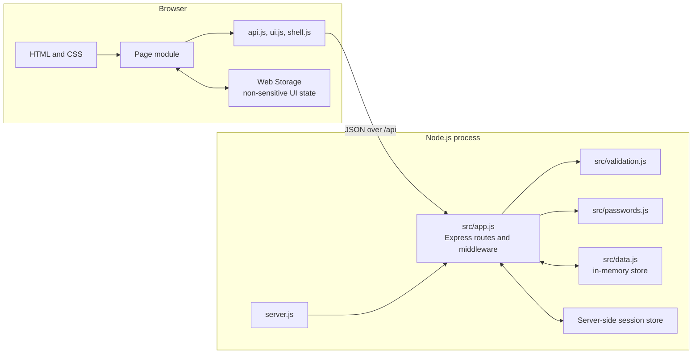

# Application architecture

This guide explains how a browser action travels through RMIT Connect. It is
written for someone comfortable with basic programming who is still learning
browser modules, HTTP APIs, and server-side state.

## The overall shape



The browser never imports server files. It communicates with the server only
through HTTP requests to `/api/...`. Likewise, the server never manipulates page
elements; it returns JSON and lets the relevant page module render it.

## Browser modules

Every HTML page loads one page-specific ES module. That module imports small
shared modules instead of duplicating request, message, or session code.

| Module | Responsibility |
| --- | --- |
| `public/js/api.js` | Sends same-origin requests, parses the common response envelope, and throws `ApiError` for controlled API failures. It also exposes `getSession()`. |
| `public/js/ui.js` | Shared DOM helpers: element lookup/creation, notices, field errors, busy buttons, prices, product normalization, and empty states. Dynamic text is assigned safely rather than interpolated as HTML. |
| `public/js/shell.js` | Reads the session, enforces page-level login/admin requirements, updates shared identity/navigation, and performs logout. Server middleware remains the real authorization boundary. |
| `public/js/login.js` | Validates login fields, submits `POST /api/session`, optionally remembers only the identity, and accepts a restricted return destination. |
| `public/js/catalogue.js` | Fetches products, builds cards, performs search/filter/sort in the browser, stores safe filter state, deep-links to cards, and creates Wishlist entries. |
| `public/js/wishlist.js` | Fetches current-user Wishlist/cart/purchase state, renders summaries and items, then performs move, purchase, and delete actions with confirmation and refreshed server state. |
| `public/js/profile.js` | Loads the current profile, validates and previews edits, stores user-scoped text drafts, converts a bounded JPG/PNG to a Data URL, and sends partial profile updates. Password fields are never drafted. |
| `public/js/admin.js` | Requires an administrator shell, fetches safe users, filters the local collection, renders account rows/summaries, and requests lock/unlock changes. |

Page modules usually follow the same lifecycle:

1. Cache the required DOM elements.
2. Attach event listeners.
3. Call `initialiseShell()` when the page requires a session.
4. Show a loading state and retrieve API data.
5. Normalize and render server data with DOM helpers.
6. For mutations, validate, disable the active control, send the request, render
   authoritative returned/refetched state, and always restore the control.
7. Convert expected failures into field/page messages; unexpected network errors
   still leave a usable retry path.

## Server and data layers

| File | Responsibility |
| --- | --- |
| `server.js` | Reads `HOST`/`PORT`, creates the app, and starts listening only when run as the entry point. It re-exports test-friendly constructors/helpers. |
| `src/app.js` | Builds Express, security/session/JSON/static middleware, authorization middleware, presenters, API routes, controlled 404s, and the final error handler. |
| `src/data.js` | Defines products and seeded users/relations, owns the in-memory arrays, and provides `resetData()` for repeatable tests. |
| `src/validation.js` | Cleans and validates login/profile input independently of browser validation. The profile allow-list blocks protected-field mass assignment. |
| `src/passwords.js` | Creates salted scrypt password records and verifies supplied passwords with a timing-safe comparison. |

Two small response helpers keep the contract consistent:

```js
{ success: true, data: { /* route result */ } }
```

```js
{
    success: false,
    error: {
        code: "VALIDATION_ERROR",
        message: "Correct the highlighted fields.",
        fields: { /* optional field messages */ }
    }
}
```

Presenter functions build public product, Wishlist, purchase, and user objects.
Routes must return presenters rather than raw user records because raw records
contain password hashes and salts.

## Session and ownership flow

1. `POST /api/session` validates the body, finds the normalized username/email,
   verifies the password, rejects locked users, and regenerates the session.
2. The session stores only `userId`; the browser receives an HTTP-only cookie,
   not the session record or password data.
3. On a protected request, `requireUser` reads `request.session.userId`, finds the
   current user, checks current lock status, and assigns `request.currentUser`.
4. `requireAdmin` additionally checks `request.currentUser.role`.
5. User-owned queries always compare a relation's `userId` with
   `request.currentUser.id`. A body/query/path value cannot choose the owner.

This distinction matters: `shell.js` may hide or redirect a page for usability,
but only `requireUser`/`requireAdmin` protect the data.

## CRUD flows

CRUD means Create, Read, Update, and Delete. Different resources expose only the
operations needed by this prototype.

### Session

- **Create:** `POST /api/session` signs in and creates/regenerates session state.
- **Read:** `GET /api/session` returns safe authentication state.
- **Delete:** `DELETE /api/session` destroys the session and clears the cookie.

### Products and Wishlist

- **Read products:** `GET /api/products` returns the entire catalogue and
  current-user saved flags. Browser code owns search/filter/sort.
- **Create saved relation:** `POST /api/wishlist` validates the product, derives
  ownership from the session, rejects an existing Wishlist/cart relation, adds
  the entry, and updates the product counter.
- **Read state:** `GET /api/wishlist` independently filters Wishlist, cart, and
  purchases by the current user, then presents each linked product.
- **Update relation:** `PATCH /api/wishlist/:productId` finds only the current
  user's relation. `move-to-cart` transfers it; `mark-purchased` removes it and
  creates purchase history. Counters are adjusted with the transition.
- **Delete relation:** `DELETE /api/wishlist/:productId` removes only the current
  user's Wishlist/cart entry and prevents counters from falling below zero.

Clients render the returned summary or refetch after a mutation. They do not
guess that a server mutation succeeded.

### Profile

- **Read:** `GET /api/profile` presents `request.currentUser` safely.
- **Update:** `PATCH /api/profile` rejects unsupported fields, validates all
  supplied values, enforces case-insensitive email uniqueness, verifies the
  current password before a password change, hashes the replacement, and applies
  only allowed fields to the current account.

The browser's confirm-password field is a UI check and is not stored. The API
receives only the actual new password and current-password proof.

### Administration

- **Read:** `GET /api/admin/users` applies both authorization middleware layers,
  maps every account through the safe presenter, sorts the result, and calculates
  summary counts.
- **Update:** `PATCH /api/admin/users/:userId/status` accepts only `active` or
  `locked`, rejects unknown users, and prevents an administrator from locking
  their own account. A newly locked user's next protected request is rejected.

## Web Storage and security boundaries

Web Storage is readable by JavaScript and is therefore for convenience, not
authentication or secrets.

| Storage | Stored here | Never stored here |
| --- | --- | --- |
| `sessionStorage` | Catalogue/admin filter choices for the current tab | Passwords, cookie/session values, roles, authorization decisions |
| `localStorage` | Optional remembered login identity; profile name/email/description draft scoped by user identity | Current/new passwords, hashes, salts, tokens, avatar binary data |
| HTTP-only session cookie | Opaque session identifier managed by the browser | Application/profile data |
| Server session | Authenticated `userId` | Plain-text password |

Browser validation improves immediate feedback but is bypassable. Server
validation, authorization, ownership checks, field allow-lists, unique indexes
(in the future database), and safe presenters are the security boundary.

Other boundaries include `SameSite=Lax` and production-secure cookies, no-store
API responses, a restrictive Content Security Policy, size-limited JSON/images,
no inline event handlers, and DOM construction/text assignment for dynamic data.

## Extending the architecture for Assessment 3

The browser/API contract can stay mostly unchanged while persistence is replaced:

1. Add repository modules such as `userRepository`, `productRepository`, and
   `wishlistRepository`; routes call these instead of accessing arrays directly.
2. Implement repositories with MongoDB Atlas collections described in
   [`database-schema.md`](database-schema.md).
3. Convert string seed IDs at the repository boundary while continuing to expose
   stable public IDs/slugs to browser code.
4. Enforce unique indexes for usernames, student IDs, normalized emails, and
   `(userId, productId)` Wishlist/cart pairs. Translate duplicate-key errors into
   the existing controlled `409` responses.
5. Use MongoDB transactions for move-to-cart and purchase transitions so relation
   and counter/history writes cannot partially complete.
6. Replace Express MemoryStore with a durable session store and configure secret,
   proxy, HTTPS, expiry, and cookie policy from deployment environment variables.
7. Move avatars to validated object storage and keep only their URL/metadata in
   the user document.
8. Keep the current integration tests, swap in a disposable test database, and
   add repository/index/transaction tests. Existing ownership and response tests
   become regression protection during the migration.

The key design goal is separation: pages depend on API contracts, API routes
depend on validation/authentication plus repositories, and repositories alone
depend on the chosen database.
