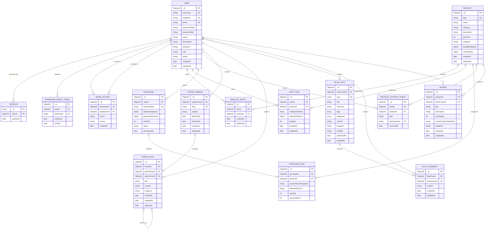

# Proposed MongoDB Atlas schema

The final group application must store backend data in MongoDB Atlas. The
current Assessment 2 branch is deliberately an in-memory prototype, so this
document separates what exists now from the persistence model planned for the
complete team application.

## Scope and implementation status

| Area | Current Assessment 2 branch | Planned MongoDB Atlas model |
| --- | --- | --- |
| Accounts, login, profile, and administration | Implemented with resettable in-memory users and sessions | `users`, `sessions`, `passwordResetTokens`, and `adminActions` |
| Catalogue, wishlist, cart hand-off, and purchase history | Implemented with in-memory products and user-owned relations | `products`, `wishlistEntries`, `cartItems`, `purchases`, `purchaseItems`, and `productActivityEvents` |
| Discussion forum | Teammate-owned; not part of Dat's implemented slice | `forumThreads` and `forumPosts` |
| Blog and comments | Teammate-owned; not part of Dat's implemented slice | `blogPosts` and `blogComments` |
| Product reviews and ratings | Teammate-owned; not part of Dat's implemented slice | `reviews` linked to users, products, and purchase history |
| Sitemap | Not persisted | Generated from registered/static routes and public database records |

The added collections are a team integration contract, not a claim that the
teammate-owned modules have already been implemented on this branch.

## Full-team relationship diagram



`FK` labels represent application-level references. MongoDB does not enforce
relational foreign keys, so the service layer must validate every referenced
record, ownership rule, and account status.

## Collection contracts

### Shared account and administration collections

#### `users`

- Store `username` and `email` in normalized lowercase form so unique indexes
  enforce case-insensitive uniqueness. Preserve `name` separately for display.
- `role` is `admin` or `member`.
- `status` is `active`, `locked`, or `deactivated`. Optional audit fields include
  `lockedAt`, `lockedByUserId`, and `deactivatedAt`.
- The profile stores `name`, `description`, `email`, and an `avatarUrl`. Image
  files belong in the project's image storage; MongoDB stores their URLs and
  optional metadata rather than large Data URLs.
- Password hashes and salts are never returned by an API. Plaintext passwords
  are never stored.

#### `sessions`

- Use a MongoDB-compatible Express session store rather than the development
  `MemoryStore`.
- A session identifies its user and has `createdAt`, `lastSeenAt`, and
  `expiresAt`. A TTL index removes expired sessions.
- Every protected request still reads the current user status. Locking,
  deactivating, or deleting an account must invalidate or reject existing
  sessions immediately.

#### `passwordResetTokens`

- Store only a cryptographic hash of the one-use reset token, never the token
  sent to the user.
- `expiresAt` supports automatic expiry and `usedAt` prevents replay.
- Issuing a newer token invalidates older unused tokens for that user.

#### `adminActions`

- Records security-sensitive actions such as `lock_user`, `unlock_user`, and
  `deactivate_user`, including actor, target, reason, and timestamp.
- Administration uses the same `users.status` source of truth; the audit record
  is evidence, not a second copy of account state.

### Product, wishlist, cart, and order collections

#### `products`

- `slug` is the stable URL/API identifier corresponding to the current string
  product ID.
- Store prices as integer VND to avoid floating-point rounding.
- Fixed product data includes title/name, description, category, image URL and
  alt text, price, and valid selectable details such as size or colour.
- `cachedStats` may expose wishlist, cart, and purchase counts efficiently, but
  it is a rebuildable projection of entries/events. It is not an independent
  source of truth.

#### `wishlistEntries`

- A row represents a currently saved user-product relationship and stores
  references rather than copied product details.
- A compound unique index on `{ userId, productId }` prevents duplicate wishlist
  entries for the same user and product.
- Removing or moving an item deletes this current-state relation, while the
  corresponding immutable activity event preserves historical statistics.

#### `cartItems`

- A row represents a product currently in one user's cart.
- `selectedOptions` holds user-editable text details validated against the
  product's allowed options; `quantity` is a positive bounded integer.
- Product title, image, and current price remain fixed product data and are
  populated from `products` when the cart is retrieved.
- `configurationKey` is a deterministic key made from normalized selected
  options. A compound unique index prevents duplicate rows for the same user,
  product, and configuration; adding that configured product increments its
  quantity.

#### `purchases` and `purchaseItems`

- `purchases` is the completed order header with user, order number, totals,
  delivery snapshot, safe payment summary, status, and purchase time.
- Never store a CVV or full credit-card number. A simulated checkout should
  validate and discard raw input, retaining only safe fields such as card brand,
  last four digits, and a mock/provider reference.
- `purchaseItems` captures product name, image URL, selected details, quantity,
  and `pricePaidVnd` at checkout. Later catalogue edits therefore do not rewrite
  order history.
- A detailed confirmation page reads the immutable purchase and item snapshots.

#### `productActivityEvents`

- Immutable event types are `wishlist_added`, `wishlist_removed`,
  `moved_to_cart`, and `purchased`.
- These events make the assignment's historical statistics possible. Current
  wishlist rows can answer "how many users have this saved now", but cannot
  answer "how many times was this ever added or moved" after rows are deleted.
- `operationKey` is an idempotency key. A retry must not increment a statistic
  twice.
- Public statistics are aggregated by product and type; user identifiers are
  never exposed in the public result.

### Discussion forum collections

#### `forumThreads`

- Stores the thread subject, stable slug, creator, visibility, and timestamps.
- `firstPostAt` and `lastPostAt` are maintained from visible posts so threads can
  be sorted efficiently by oldest or most recent post as required.
- The initial post is stored in `forumPosts`, so it has the same title, content,
  image, author, timestamp, edit, and deletion rules as every reply.

#### `forumPosts`

- Every post references its thread and author. `parentPostId` is `null` for an
  initial/top-level post and references another post for a threaded reply.
- Main data is `title`, `content`, `imageUrl`, `imageAlt`, author, and timestamp.
  `updatedAt` records edits.
- Deletion is soft: set `deletedAt`, `deletedByUserId`, and optionally
  `deletionReason`; retain the record for auditing and render a neutral tombstone
  when replies still exist.
- Update/delete queries must include both `_id` and the authenticated
  `authorUserId`. Administrative moderation is a separate authorized path.
- Searching combines the thread-subject text index with matching post IDs;
  filtering must omit soft-deleted post content from public results.

### Blog collections

#### `blogPosts`

- Main data includes title, author, added/published date, tags/categories, full
  text, image URL/alt text, and a generated preview summary/thumbnail.
- `visibility` is `draft`, `public`, or `archived`. Public list views return
  previews; detail views return full content and comments.
- Only the author (or an explicitly authorized administrator) may edit or delete
  a post. `deletedAt` can retain moderation/audit history while excluding the
  post from public queries.
- Search covers title, summary, full text, tags, and categories; separate indexes
  support author and date filters.

#### `blogComments`

- A comment references its blog post and authenticated author and stores content
  plus creation/update timestamps.
- Although comment creation is not separately listed as a CRUD requirement, a
  stored comment collection is required for the mandated detailed view that
  displays comments.
- If comment deletion is supported, use the same ownership and soft-deletion
  pattern as forum posts.

### Product review and rating collection

#### `reviews`

- Each review references the product and authenticated author and stores title,
  description, integer `starRating` from 1 to 5, reviewer-name snapshot, added
  date, image URL, and image alt text.
- The reviewer snapshot preserves what was displayed at submission time; the
  user reference remains the authority for ownership.
- Before creation, the service checks purchase history or another documented
  product-use entitlement. The client cannot declare itself eligible.
- List responses provide previews; detail responses provide the full review.
  Search/filter supports title, description, reviewer, rating, product, and date.
- Only the authenticated author (or an authorized moderator) may update or
  delete a review. Soft deletion is recommended if moderation history is needed.
- Whether one active review is allowed per user-product pair is a team product
  decision, not an assignment requirement. Add a partial unique index only if
  the team adopts that rule.

## Required indexes

The examples below use collection names from this document. Each collection may
have only one MongoDB text index, so related searchable fields are combined.

```javascript
db.users.createIndex({ username: 1 }, { unique: true });
db.users.createIndex({ studentId: 1 }, { unique: true });
db.users.createIndex({ email: 1 }, { unique: true });
db.users.createIndex({ role: 1, status: 1, name: 1 });

db.sessions.createIndex({ expiresAt: 1 }, { expireAfterSeconds: 0 });
db.sessions.createIndex({ userId: 1 });
db.passwordResetTokens.createIndex({ tokenHash: 1 }, { unique: true });
db.passwordResetTokens.createIndex({ expiresAt: 1 }, { expireAfterSeconds: 0 });
db.passwordResetTokens.createIndex({ userId: 1, usedAt: 1 });
db.adminActions.createIndex({ actorUserId: 1, createdAt: -1 });
db.adminActions.createIndex({ targetUserId: 1, createdAt: -1 });

db.products.createIndex({ slug: 1 }, { unique: true });
db.products.createIndex({ category: 1, name: 1 });
db.products.createIndex({ name: 1 });
db.products.createIndex({ priceVnd: 1 });
db.products.createIndex({ name: "text", description: "text", category: "text" });
db.wishlistEntries.createIndex({ userId: 1, productId: 1 }, { unique: true });
db.wishlistEntries.createIndex({ productId: 1, createdAt: -1 });
db.cartItems.createIndex(
    { userId: 1, productId: 1, configurationKey: 1 },
    { unique: true }
);
db.cartItems.createIndex({ userId: 1, quantity: 1 });
db.cartItems.createIndex({ userId: 1, updatedAt: -1 });
db.purchases.createIndex({ orderNumber: 1 }, { unique: true });
db.purchases.createIndex({ userId: 1, purchasedAt: -1 });
db.purchaseItems.createIndex({ purchaseId: 1 });
db.purchaseItems.createIndex({ productId: 1 });
db.productActivityEvents.createIndex({ operationKey: 1 }, { unique: true });
db.productActivityEvents.createIndex({ productId: 1, type: 1, occurredAt: -1 });
db.productActivityEvents.createIndex({ userId: 1, productId: 1, occurredAt: -1 });

db.forumThreads.createIndex({ slug: 1 }, { unique: true });
db.forumThreads.createIndex({ subject: "text" });
db.forumThreads.createIndex({ lastPostAt: -1 });
db.forumThreads.createIndex({ firstPostAt: 1 });
db.forumPosts.createIndex({ threadId: 1, createdAt: 1 });
db.forumPosts.createIndex({ parentPostId: 1, createdAt: 1 });
db.forumPosts.createIndex({ authorUserId: 1, updatedAt: -1 });
db.forumPosts.createIndex({ title: "text", content: "text" });

db.blogPosts.createIndex({ slug: 1 }, { unique: true });
db.blogPosts.createIndex({ authorUserId: 1, publishedAt: -1 });
db.blogPosts.createIndex({ visibility: 1, publishedAt: -1 });
db.blogPosts.createIndex({ visibility: 1, categories: 1, publishedAt: -1 });
db.blogPosts.createIndex({ visibility: 1, tags: 1, publishedAt: -1 });
db.blogPosts.createIndex({
    title: "text",
    summary: "text",
    content: "text",
    tags: "text",
    categories: "text"
});
db.blogComments.createIndex({ blogPostId: 1, createdAt: 1 });
db.blogComments.createIndex({ authorUserId: 1, createdAt: -1 });

db.reviews.createIndex({ productId: 1, createdAt: -1 });
db.reviews.createIndex({ productId: 1, starRating: 1 });
db.reviews.createIndex({ authorUserId: 1, createdAt: -1 });
db.reviews.createIndex({ starRating: 1, createdAt: -1 });
db.reviews.createIndex({
    title: "text",
    description: "text",
    reviewerNameSnapshot: "text",
    imageAlt: "text"
});
```

Every write endpoint must catch duplicate-key error `11000` and translate it to
a controlled `409 Conflict`. An index is not a substitute for a useful API
response or server-side validation.

## Representative document shapes

The values are illustrative. Real hashes, salts, reset tokens, session IDs, and
payment secrets must not appear in source control.

```javascript
// users - implemented in memory now, persisted here later
{
    _id: ObjectId("66aa00000000000000000001"),
    username: "dat.pham",
    studentId: "S4221230",
    email: "s4221230@rmit.edu.vn",
    passwordHash: "<scrypt-hash>",
    passwordSalt: "<random-salt>",
    name: "Dat Pham",
    description: "RMIT Connect administrator.",
    avatarUrl: "/uploads/profiles/dat-pham.jpg",
    role: "admin",
    status: "active",
    lastActiveAt: ISODate("2026-08-15T08:30:00Z"),
    createdAt: ISODate("2026-07-01T08:00:00Z"),
    updatedAt: ISODate("2026-08-15T08:30:00Z")
}

// products - fixed catalogue data plus a rebuildable statistics projection
{
    _id: ObjectId("66bb00000000000000000001"),
    slug: "data-bootcamp",
    name: "Data Visualisation Bootcamp",
    category: "Short Course",
    description: "A practical evening data visualisation session.",
    priceVnd: 95000,
    imageUrl: "/images/data-bootcamp.jpg",
    imageAlt: "Two students pointing at information on a laptop screen",
    availableOptions: { session: ["Tuesday", "Thursday"] },
    cachedStats: { savedNow: 63, addedTotal: 84, movedToCartTotal: 28, purchasedTotal: 17 },
    createdAt: ISODate("2026-07-01T08:00:00Z"),
    updatedAt: ISODate("2026-08-15T08:30:00Z")
}

// wishlistEntries - one current saved relation per user and product
{
    _id: ObjectId("66cc00000000000000000001"),
    userId: ObjectId("66aa00000000000000000001"),
    productId: ObjectId("66bb00000000000000000001"),
    createdAt: ISODate("2026-08-15T08:30:00Z"),
    updatedAt: ISODate("2026-08-15T08:30:00Z")
}

// cartItems - editable quantity/options, fixed product data populated on read
{
    _id: ObjectId("66dd00000000000000000001"),
    userId: ObjectId("66aa00000000000000000001"),
    productId: ObjectId("66bb00000000000000000001"),
    configurationKey: "session=thursday",
    selectedOptions: { session: "Thursday" },
    quantity: 1,
    createdAt: ISODate("2026-08-15T08:35:00Z"),
    updatedAt: ISODate("2026-08-15T08:35:00Z")
}

// purchases - safe order, delivery, and payment summary
{
    _id: ObjectId("66ee00000000000000000001"),
    userId: ObjectId("66aa00000000000000000001"),
    orderNumber: "RMIT-20260815-0001",
    deliverySnapshot: {
        recipientName: "Dat Pham",
        addressLine1: "702 Nguyen Van Linh",
        city: "Ho Chi Minh City",
        postalCode: "700000",
        country: "Vietnam"
    },
    paymentSummary: {
        method: "simulated_card",
        cardBrand: "visa",
        cardLast4: "4242",
        providerReference: "mock_01"
    },
    totalVnd: 95000,
    status: "confirmed",
    purchasedAt: ISODate("2026-08-15T08:40:00Z")
}

// purchaseItems - immutable checkout snapshot
{
    _id: ObjectId("66ff00000000000000000001"),
    purchaseId: ObjectId("66ee00000000000000000001"),
    productId: ObjectId("66bb00000000000000000001"),
    productNameSnapshot: "Data Visualisation Bootcamp",
    imageUrlSnapshot: "/images/data-bootcamp.jpg",
    selectedOptions: { session: "Thursday" },
    quantity: 1,
    pricePaidVnd: 95000
}

// forumThreads and forumPosts - posts hold both initial content and replies
{
    _id: ObjectId("670000000000000000000001"),
    authorUserId: ObjectId("66aa00000000000000000001"),
    slug: "welcome-to-peer-coding",
    subject: "Welcome to peer coding",
    visibility: "public",
    firstPostAt: ISODate("2026-08-16T08:00:00Z"),
    lastPostAt: ISODate("2026-08-16T09:15:00Z"),
    createdAt: ISODate("2026-08-16T08:00:00Z"),
    updatedAt: ISODate("2026-08-16T09:15:00Z")
}
{
    _id: ObjectId("670000000000000000000002"),
    threadId: ObjectId("670000000000000000000001"),
    parentPostId: null,
    authorUserId: ObjectId("66aa00000000000000000001"),
    title: "First workshop topic",
    content: "Which accessibility topic should we practise first?",
    imageUrl: "/uploads/forum/accessibility-notes.jpg",
    imageAlt: "Handwritten accessibility workshop notes",
    createdAt: ISODate("2026-08-16T08:00:00Z"),
    updatedAt: ISODate("2026-08-16T08:00:00Z")
}

// blogPosts and blogComments - preview fields support list view
{
    _id: ObjectId("671000000000000000000001"),
    authorUserId: ObjectId("66aa00000000000000000001"),
    slug: "campus-photography-walk-notes",
    title: "Campus photography walk notes",
    summary: "Five practical lessons from the student photo walk.",
    tags: ["photography", "campus"],
    categories: ["Club Activity"],
    content: "<sanitized rich text or plain text>",
    imageUrl: "/uploads/blog/photo-walk-notes.jpg",
    imageAlt: "Students photographing the campus courtyard",
    visibility: "public",
    publishedAt: ISODate("2026-08-16T10:00:00Z"),
    updatedAt: ISODate("2026-08-16T10:00:00Z")
}
{
    _id: ObjectId("671000000000000000000002"),
    blogPostId: ObjectId("671000000000000000000001"),
    authorUserId: ObjectId("66aa00000000000000000001"),
    content: "The lighting tip was especially useful.",
    createdAt: ISODate("2026-08-16T10:30:00Z"),
    updatedAt: ISODate("2026-08-16T10:30:00Z")
}

// reviews - ownership comes from authorUserId, display name is a snapshot
{
    _id: ObjectId("672000000000000000000001"),
    productId: ObjectId("66bb00000000000000000001"),
    authorUserId: ObjectId("66aa00000000000000000001"),
    title: "Useful practical introduction",
    description: "Clear examples and enough time to practise each chart.",
    starRating: 5,
    reviewerNameSnapshot: "Dat Pham",
    imageUrl: "/uploads/reviews/data-bootcamp-board.jpg",
    imageAlt: "Completed chart exercise on the workshop whiteboard",
    createdAt: ISODate("2026-08-17T07:00:00Z"),
    updatedAt: ISODate("2026-08-17T07:00:00Z")
}

// productActivityEvents - immutable input for historical wishlist statistics
{
    _id: ObjectId("673000000000000000000001"),
    userId: ObjectId("66aa00000000000000000001"),
    productId: ObjectId("66bb00000000000000000001"),
    type: "wishlist_added",
    operationKey: "wishlist-add:user-dat:data-bootcamp:20260815T083000Z",
    occurredAt: ISODate("2026-08-15T08:30:00Z")
}
```

## Atomic transitions and invariants

1. Resolve identity from the authenticated session; never accept a client-sent
   owner ID as authority.
2. Reject every protected operation when the user is locked or deactivated.
3. Validate references, input allowlists, lengths, ratings, prices, and quantities
   on the server before beginning the write.
4. For wishlist-to-cart, atomically delete the wishlist entry, upsert the cart
   item, add a `moved_to_cart` event, and update/rebuild cached statistics.
5. For checkout, atomically create the purchase and item snapshots, remove or
   update cart rows, add `purchased` events, and return the completed order.
6. For a new forum thread, atomically create its thread record and initial post.
   Reply creation and soft deletion update the thread's first/last visible-post
   timestamps in the same transaction.
7. Blog, forum, and review mutations include the authenticated author's ID in
   the write predicate. A successful lookup followed by an unscoped update is
   not sufficient ownership protection.
8. Use `operationKey` or an equivalent idempotency token for retried transitions,
   then commit. Abort the transaction if any operation fails.
9. Re-read and return the authenticated user's current state after commit rather
   than constructing a response from uncommitted client input.

Locking an account is a `users` state update plus an `adminActions` audit insert.
All active sessions for the target are removed or denied as part of that change.

## Sitemap persistence decision

The sitemap does **not** need its own MongoDB collection. It is a derived view,
not authoritative business data:

- Discover static/public HTML pages from the server's route registry or build
  manifest rather than maintaining a second hard-coded list.
- Query public forum threads/posts, public blog posts, catalogue products, and
  any other public detail routes from their source collections.
- Combine those results into a hierarchical, clickable HTML response on each
  request, or cache it briefly and invalidate the cache after public content
  changes.
- Exclude drafts, soft-deleted content, account-only pages, and administration
  routes for users who cannot access them.

Persisting a sitemap document would create a stale duplicate. If a generated
XML/HTML file is cached for deployment, it remains a rebuildable artifact rather
than a source-of-truth collection.

## Assessment 2 to persistent mapping

| Current in-memory structure | MongoDB destination | Migration note |
| --- | --- | --- |
| `users` array | `users` | Split password fields as needed; normalize username/email; retain role/status |
| Product template/`products` array | `products` | Convert string IDs to slugs/ObjectIds; treat seeded stats as a cache only |
| `wishlist` array | `wishlistEntries` | Preserve unique user-product ownership and timestamps |
| `cart` array | `cartItems` | Add bounded quantity, validated selected options, and a configuration key |
| `purchases` array | `purchases` plus `purchaseItems` | Expand the current one-product history into immutable order snapshots |
| Express `MemoryStore` | `sessions` | Use a durable compatible session store with TTL expiry |
| No current event history | `productActivityEvents` | Required for accurate all-time add/cart/purchase statistics |
| Teammate module data after merge | Forum/blog/review collections above | Adapt route services to this shared ownership/reference contract |

Browser/API contracts can remain stable while repository functions replace
direct array access. This keeps client modules independent of the storage
technology and lets the team migrate one service at a time.

## Assumptions requiring team confirmation

- Product images and uploaded content are stored as files or object-storage
  objects; MongoDB stores URLs and metadata, matching the assignment rule.
- Blog comments are persisted because the required detail view displays them,
  even though separate comment CRUD is not explicitly graded.
- Forum deletions are soft because the brief explicitly requires deleted posts
  to remain in the database for auditing.
- Reviews use purchase history (or a separately documented usage entitlement)
  to prove that the reviewer purchased or used the product.
- One active review per user-product pair is optional. The team must decide and
  document that policy before adding a unique index.
- Sitemap links are derived from route metadata and public records, so no
  dedicated sitemap collection is created.
