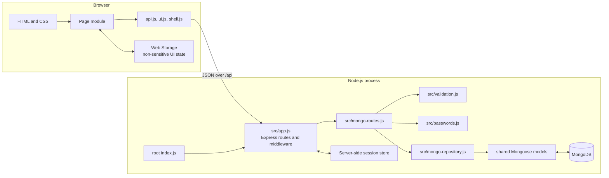

# Application architecture

This guide explains how a browser action travels through RMIT Connect. It is
written for someone comfortable with basic programming who is still learning
browser modules, HTTP APIs, and server-side state.

## The overall shape



The browser never imports server files. It communicates with the server only
through HTTP requests to `/api/...`. Likewise, the server never manipulates page
elements; it returns JSON and lets the relevant page module render it.

## Browser modules

Every HTML page loads one page-specific ES module. That module imports small
shared modules instead of duplicating request, message, or session code.

| Module | Responsibility |
| --- | --- |
| `public/js/api.js` | Sends same-origin requests, parses the common response envelope, and throws `ApiError` for controlled API failures. It also exposes `getSession()`. |
| `public/js/ui.js` | Shared DOM helpers: element lookup/creation, notices, field errors, busy buttons, prices, product normalization, and empty states. Dynamic text is assigned safely rather than interpolated as HTML. |
| `public/js/shell.js` | Reads the session, enforces page-level login/admin requirements, updates shared identity/navigation, and performs logout. Server middleware remains the real authorization boundary. |
| `public/js/login.js` | Validates login fields, submits `POST /api/session`, optionally remembers only the identity, and accepts a restricted return destination. |
| `public/js/catalogue.js` | Fetches products, builds cards, performs search/filter/sort in the browser, stores safe filter state, deep-links to cards, and creates Wishlist entries. |
| `public/js/wishlist.js` | Fetches current-user Wishlist/cart/purchase state, renders summaries and items, then performs move, purchase, and delete actions with confirmation and refreshed server state. |
| `public/js/profile.js` | Loads the current profile, validates and previews edits, stores user-scoped text drafts, converts a bounded JPG/PNG to a Data URL, and sends partial profile updates. Password fields are never drafted. |
| `public/js/admin.js` | Requires an administrator shell, fetches safe users, filters the local collection, renders account rows/summaries, and requests lock/unlock changes. |

Page modules usually follow the same lifecycle:

1. Cache the required DOM elements.
2. Attach event listeners.
3. Call `initialiseShell()` when the page requires a session.
4. Show a loading state and retrieve API data.
5. Normalize and render server data with DOM helpers.
6. For mutations, validate, disable the active control, send the request, render
   authoritative returned/refetched state, and always restore the control.
7. Convert expected failures into field/page messages; unexpected network errors
   still leave a usable retry path.

## Server and data layers

| File | Responsibility |
| --- | --- |
| Root `index.js` | Connects MongoDB, owns the one shared team session, mounts all team routes, and starts listening after models and indexes are ready. |
| `src/app.js` | Builds the standalone module for tests or mounts the Mongo router into the integrated server. `useExistingSession` prevents a second session store when nested. |
| `src/mongo-routes.js` | Implements Account, Administration, Product, and Wishlist HTTP routes with session authorization and controlled response envelopes. |
| `src/mongo-repository.js` | Owns Mongoose queries, transactions, projections, relationship traversal, duplicate-key translation, filtering, and sorting. |
| Root `models/*.js` | Define the shared User and Dat-owned Product, WishlistEntry, Purchase, and PasswordResetToken collection contracts and indexes. |
| `src/data.js` | Retains the Assessment 2 in-memory adapter only for fast isolated compatibility tests; production does not use it. |
| `src/validation.js` | Cleans and validates login/profile input independently of browser validation. The profile allow-list blocks protected-field mass assignment. |
| `src/passwords.js` | Creates and verifies bcrypt `passwordHash` strings; live routes use asynchronous helpers so hashing does not block the request loop. |

Two small response helpers keep the contract consistent:

```js
{ success: true, data: { /* route result */ } }
```

```js
{
    success: false,
    error: {
        code: "VALIDATION_ERROR",
        message: "Correct the highlighted fields.",
        fields: { /* optional field messages */ }
    }
}
```

Repository/presenter functions build public product, Wishlist, purchase, and
user objects. Routes never return raw User records because raw records may
contain a `passwordHash`; the schema also excludes that field from normal
queries as a second defence.

## Session and ownership flow

1. `POST /api/session` validates the body, finds the normalized username/email,
   verifies the password, rejects locked users, and regenerates the session.
2. The session stores `userId` and the User's non-secret `authVersion`; the
   browser receives an HTTP-only cookie, not the session record or password data.
3. On a protected request, `requireUser` reads `request.session.userId`, finds the
   current user, checks active status and the matching `authVersion`, and assigns
   `request.currentUser`. A password/status change therefore revokes dormant
   sessions; the session performing its own password change receives the new
   version after the database commit.
4. `requireAdmin` additionally checks `request.currentUser.role`.
5. User-owned queries always compare a relation's `userId` with
   `request.currentUser.id`. A body/query/path value cannot choose the owner.

This distinction matters: `shell.js` may hide or redirect a page for usability,
but only `requireUser`/`requireAdmin` protect the data.

## CRUD flows

CRUD means Create, Read, Update, and Delete. Different resources expose only the
operations needed by this prototype.

### Session

- **Create:** `POST /api/session` signs in and creates/regenerates session state.
- **Read:** `GET /api/session` returns safe authentication state.
- **Delete:** `DELETE /api/session` destroys the session and clears the cookie.

### Products and Wishlist

- **Read products:** `GET /api/products` queries active catalogue records,
  applies indexed search/category/sort options, derives relationship statistics,
  and returns current-user saved flags. The browser may further filter the
  already returned list for immediate presentation.
- **Create saved relation:** `POST /api/wishlist` validates the product, derives
  ownership from the session, rejects an existing Wishlist/cart relation, adds
  the entry. A compound unique index prevents concurrent duplicates.
- **Read state:** `GET /api/wishlist` independently filters Wishlist, cart, and
  purchases by the current user using indexed queries, then presents each linked
  product and immutable purchase name/price snapshots.
- **Update relation:** `PATCH /api/wishlist/:productId` finds only the current
  user's relation. `move-to-cart` transfers it; `mark-purchased` removes it and
  creates purchase history in one transaction. Displayed statistics are derived
  from source relations rather than mutable counters.
- **Delete relation:** `DELETE /api/wishlist/:productId` removes only the current
  user's Wishlist/cart entry.

Clients render the returned summary or refetch after a mutation. They do not
guess that a server mutation succeeded.

### Profile

- **Read:** `GET /api/profile` presents `request.currentUser` safely.
- **Update:** `PATCH /api/profile` rejects unsupported fields, validates all
  supplied values, enforces case-insensitive email uniqueness, verifies the
  current password before a password change, hashes the replacement, and applies
  only allowed fields to the current account.

The browser's confirm-password field is a UI check and is not stored. The API
receives only the actual new password and current-password proof.

### Administration

- **Read:** `GET /api/admin/users` applies both authorization middleware layers,
  maps every account through the safe presenter, sorts the result, and calculates
  summary counts.
- **Update:** `PATCH /api/admin/users/:userId/status` accepts only `active` or
  `locked`, rejects unknown users, and prevents an administrator from locking
  their own account. A real state change increments `authVersion` and removes
  reset challenges when locking; a repeated same-status request is a no-op.

## Web Storage and security boundaries

Web Storage is readable by JavaScript and is therefore for convenience, not
authentication or secrets.

| Storage | Stored here | Never stored here |
| --- | --- | --- |
| `sessionStorage` | Catalogue/admin filter choices for the current tab | Passwords, cookie/session values, roles, authorization decisions |
| `localStorage` | Optional remembered login identity; profile name/email/description draft scoped by user identity | Current/new passwords, hashes, salts, tokens, avatar binary data |
| HTTP-only session cookie | Opaque session identifier managed by the browser | Application/profile data |
| Server session | Authenticated `userId` and non-secret `authVersion` | Plain-text password |

Browser validation improves immediate feedback but is bypassable. Server
validation, authorization, ownership checks, field allow-lists, MongoDB unique
indexes, and safe presenters are the security boundary.

Registration, sign-in, forgot-password, and reset-password writes are also
rate-limited. Password validation enforces bcrypt's 72 UTF-8-byte boundary so
two accepted inputs cannot become equivalent through silent truncation.

Other boundaries include `SameSite=Lax` and production-secure cookies, no-store
API responses, a restrictive Content Security Policy, size-limited JSON/images,
no inline event handlers, and DOM construction/text assignment for dynamic data.

## Assessment 3 persistence implementation

The planned migration is now implemented for Dat's individual and shared scope:

1. The browser/API contract remains stable while routes call a Mongo repository.
2. Users, products, Wishlist/cart relationships, purchases, and reset challenges
   use the collections in [`database-schema.md`](database-schema.md).
3. ObjectIds stay inside database relationships; product slugs remain stable
   public identifiers for readable links and browser state.
4. Unique indexes enforce usernames, student IDs, normalized emails, reset
   challenges, and one live Wishlist/cart relationship per user-product pair.
5. Mark-purchased and password-change/reset-token invalidation use MongoDB
   transactions so related writes cannot partially commit.
6. Production sessions use `connect-mongo`; local development uses MemoryStore,
   while `npm run start:local` supplies an isolated disposable Mongo replica set.
7. Validated avatar bytes remain on local disk for this classroom build and only
   their URL is stored in User. Hosted multi-instance deployment should replace
   this one remaining file-system boundary with team-approved object storage.
8. Hermetic replica-set tests cover schemas/indexes, persistence across an HTTP
   restart, authentication, authorization, ownership, transactions, and replay
   prevention without touching the team's Atlas database.

The key design goal is separation: pages depend on API contracts, API routes
depend on validation/authentication plus repositories, and repositories alone
depend on the chosen database.
