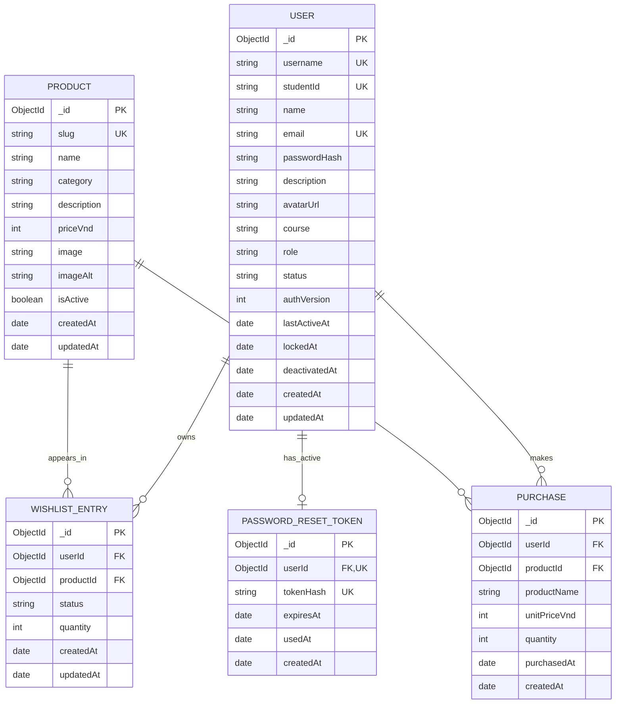

# Dat's MongoDB database design

This document is the implementation contract for Dat Pham's Assessment 3
scope: Login, Edit Profile, Administration, Wishlist and Favourites. It covers
only the collections owned or directly used by that scope. The other team
modules document their own collections separately.

The design targets the five requirements in the 10-point Database rubric:

1. a complete diagram for the assigned individual and shared features;
2. collections, documents, fields, types, validation, and relationships;
3. accurate one-to-one, one-to-many, and many-to-many relationships where they
   are relevant;
4. minimal duplication plus indexes that support real retrieval, filtering,
   and sorting;
5. an implementation that matches this design and contains representative
   sample records.

The standalone Mermaid source is in
[`database-diagram.mmd`](database-diagram.mmd). Representative records and the
expected seed coverage are in [`sample-data.md`](sample-data.md).

## Collection summary

| Physical MongoDB collection | Mongoose model | Purpose |
| --- | --- | --- |
| `users` | `User` | Login identity, password hash, profile attributes, role, and account status |
| `products` | `Product` | Canonical catalogue facts displayed by Browse Items and Wishlist |
| `wishlistentries` | `WishlistEntry` | One current user-product relationship whose state is `saved` or `cart` |
| `purchases` | `Purchase` | Immutable history created when a user marks one product as purchased |
| `passwordresettokens` | `PasswordResetToken` | At most one active, expiring reset challenge for a user |

In production, `connect-mongo` also owns a `sessions` collection. It is an
operational store for encrypted Express session records with expiry metadata,
not a domain entity authored by the Account or Wishlist repositories. It has no
business relationship to model in the ER diagram and is intentionally excluded
from the five domain collection contracts below. Local development and tests use
an in-process session store unless production mode is explicitly enabled.

The literal Mongoose schemas are defined in `models/user.js`,
`models/product.js`, `models/wishlist-entry.js`, `models/purchase.js`, and
`models/password-reset-token.js`. `models/index.js` exposes the shared model
set. `modules/account/src/mongo-repository.js` owns the Account/Wishlist queries
and keeps database details out of browser code.

There is deliberately no separate `cartitems` collection. The current product
has one action that moves an existing saved item to a cart-ready state; it does
not support independent cart variants. Keeping `status` on the single
`wishlistentries` junction makes the move one atomic update and makes the
unique user-product rule enforceable in one place.

There is also no separate `profiles` collection. A profile belongs to exactly
one account and is always read and updated with that account, so its attributes
are stored in the `users` document. This is not an undocumented relationship:
it is intentional embedding/flattening of one-to-one data.

## Complete relationship diagram



Mermaid's `o|` marker means “zero or one”; it does not mean every user must
always have a reset token. `PK`, `UK`, and `FK` mean primary key, unique key,
and application-level reference. MongoDB does not enforce foreign keys, so the
service validates referenced documents and ownership before writing.

### Cardinality and implementation

| Relationship | Cardinality | How it is represented |
| --- | --- | --- |
| User to active reset token | 1 to 0..1 | `passwordresettokens.userId` is a required reference with a unique index. Reissuing a challenge replaces/upserts the previous record. |
| User to Wishlist entries | 1 to 0..many | Each entry has one required `userId`; a user may save/cart many products. |
| Product to Wishlist entries | 1 to 0..many | Each entry has one required `productId`; a product may appear for many users. |
| User to Product (current saved/cart state) | many to many | `wishlistentries` is the junction collection. The compound unique key `(userId, productId)` allows only one current relation for each pair. |
| User to Purchases | 1 to 0..many | Each purchase belongs to one user; repeat purchases are allowed. |
| Product to Purchases | 1 to 0..many | Each purchase names one product; the same product can be purchased repeatedly. |
| User to Product (purchase history) | many to many over time | `purchases` is a historical junction. It intentionally has no unique user-product key. |
| User to profile attributes | logical 1 to 1 | `name`, `description`, `avatarUrl`, `course`, and `email` are kept in the same `users` document, not a second collection. |

## Shared conventions

- MongoDB supplies `_id: ObjectId` for every document.
- References use `ObjectId` values, never usernames or student IDs. Usernames
  and student IDs can change format; `_id` is the stable relationship key.
- All identity and ownership values come from the authenticated server session.
  A client-supplied `userId` never grants access.
- Mongoose timestamps are stored as UTC BSON dates. Presentation code may
  convert them to the user's local time.
- VND prices are non-negative integers. This avoids floating-point rounding and
  matches a currency normally displayed without a fractional unit.
- Usernames and emails are normalized to lowercase and student IDs to uppercase
  before uniqueness is checked.
- Passwords and reset tokens are never stored in plaintext. Their one-way
  hashes are excluded from normal Mongoose queries with `select: false`.
- Password input is limited to 72 UTF-8 bytes, the maximum bcrypt can compare
  without silently truncating distinct values.
- Enum values use lowercase machine-readable strings. Labels for people belong
  in the presentation layer.
- A referenced product is deactivated with `isActive: false`, not physically
  deleted, so past purchases remain interpretable.

## Collection contracts

### `users`

The shared User model remains compatible with the Discussion Forum while
adding strict validation needed by login, profile, and administration.

| Field | BSON / JS type | Required | Default and validation | Use |
| --- | --- | --- | --- | --- |
| `_id` | ObjectId | generated | MongoDB-generated | Stable account key |
| `username` | String | yes | trim; lowercase; 3-50 characters; begins/ends alphanumeric and may contain dots, underscores, or hyphens; unique | Login and display identity |
| `studentId` | String | yes | trim; uppercase; `/^S\d{7}$/`; unique | RMIT identity and Forum integration |
| `name` | String | yes | trim; 2-80 characters | Profile/admin display name |
| `email` | String | yes | trim; lowercase; general email form `/^[^\s@]+@[^\s@]+\.[^\s@]+$/`; maximum 120 characters; unique | Login and contact identity |
| `passwordHash` | String | yes | valid 60-character bcrypt hash; `select: false` | Password verifier; never an API field |
| `description` | String | no | trim; default `""`; maximum 300 characters | Profile introduction |
| `avatarUrl` | String | no | trim; default `/images/user_icon.png`; maximum 500 characters | URL/path only; image bytes are not duplicated in User |
| `course` | String | no | trim; default `""`; maximum 120 characters | Shared Forum/profile course label |
| `role` | String enum | yes | `member` or `admin`; default `member` | Server-side authorization |
| `status` | String enum | yes | `active`, `locked`, or `deactivated`; default `active` | Login and protected-route access control |
| `authVersion` | Number | yes | non-negative safe integer; default `0` | Revokes older sessions after a password or account-status change |
| `lastActiveAt` | Date or null | no | default `null` | Recent-activity administration sort/display |
| `lockedAt` | Date or null | no | default `null` | When the current lock began |
| `deactivatedAt` | Date or null | no | default `null` | When the account was deactivated |
| `createdAt` | Date | generated | Mongoose timestamp | Account creation/audit order |
| `updatedAt` | Date | generated | Mongoose timestamp | Last document change |

Status timestamp invariants are enforced in the service: `locked` requires
`lockedAt`, `deactivated` requires `deactivatedAt`, and returning to `active`
clears both state timestamps. A password change replaces `passwordHash` and
increments `authVersion`; the plaintext current and new password fields are
request input, never User fields. Protected requests require the stored session
version to equal the current User version. The repository also refuses to
deactivate the last active administrator.

### `products`

`products` is the only source of current catalogue names, descriptions, images,
categories, prices, and availability.

| Field | BSON / JS type | Required | Default and validation | Use |
| --- | --- | --- | --- | --- |
| `_id` | ObjectId | generated | MongoDB-generated | Reference target |
| `slug` | String | yes | trim; lowercase; URL-safe hyphenated identifier; unique | Stable public API/product identifier |
| `name` | String | yes | trim; 2-120 characters | Card title and text search |
| `category` | String | yes | trim; 2-60 characters | Catalogue filter and sort |
| `description` | String | yes | trim; 10-1,000 characters | Card content and text search |
| `priceVnd` | Number (integer) | yes | safe integer from `0` to `1,000,000,000` | Price filter/sort and purchase snapshot source |
| `image` | String | yes | trim; maximum 500 characters | Same-origin image path or approved URL |
| `imageAlt` | String | yes | trim; 3-200 characters | Accessible image description |
| `isActive` | Boolean | yes | default `true` | Soft catalogue removal without breaking history |
| `createdAt` | Date | generated | Mongoose timestamp | Audit and stable tie-breaking |
| `updatedAt` | Date | generated | Mongoose timestamp | Catalogue change time |

Statistics are not fields on Product. Current saved/cart totals are aggregated
from `wishlistentries`; completed totals are aggregated from `purchases`. This
prevents counters becoming inconsistent with the records they claim to count.

### `wishlistentries`

This is both the current Wishlist junction and the cart-ready state. An entry
does not copy product name, price, category, or image; those are populated/read
from Product when a response is assembled.

| Field | BSON / JS type | Required | Default and validation | Use |
| --- | --- | --- | --- | --- |
| `_id` | ObjectId | generated | MongoDB-generated | Entry key |
| `userId` | ObjectId ref `User` | yes | must resolve to the authenticated active user | Owner |
| `productId` | ObjectId ref `Product` | yes | must resolve to an active Product when adding | Selected product |
| `status` | String enum | yes | `saved` or `cart`; default `saved` | Current workflow state |
| `quantity` | Number (integer) | yes | integer 1-99; default `1` | Desired quantity in current state |
| `createdAt` | Date | generated | Mongoose timestamp | Date first added |
| `updatedAt` | Date | generated | Mongoose timestamp | Recent-state sort and move time |

The unique `(userId, productId)` index rejects a duplicate whether the existing
row is `saved` or `cart`. Moving to cart is therefore a single conditional
`$set` of `status`, rather than a delete followed by an insert that could fail
halfway through.

### `purchases`

The present feature marks one Wishlist/cart product as purchased. A Purchase is
therefore one immutable event, not an invented multi-item checkout/order header.

| Field | BSON / JS type | Required | Default and validation | Use |
| --- | --- | --- | --- | --- |
| `_id` | ObjectId | generated | MongoDB-generated | Purchase key |
| `userId` | ObjectId ref `User` | yes | must resolve to the authenticated user | Purchaser/ownership |
| `productId` | ObjectId ref `Product` | yes | must resolve when the event is created | Catalogue relationship |
| `productName` | String | yes | trim; 2-120 characters | Immutable display snapshot |
| `unitPriceVnd` | Number (integer) | yes | safe integer from `0` to `1,000,000,000` | Immutable paid-price snapshot |
| `quantity` | Number (integer) | yes | integer 1-99 | Purchased quantity |
| `purchasedAt` | Date | yes | default current server time | History sort and reporting |
| `createdAt` | Date | generated | Mongoose creation timestamp | Technical audit time |

`productName` and `unitPriceVnd` are intentional, limited duplication. Purchase
history must still show what the user bought and paid if the catalogue item is
renamed, repriced, or deactivated. Current descriptive fields and images are not
copied because the current UI can populate them from Product.

There is no unique `(userId, productId)` index: buying the same product again is
a required and valid favourites workflow.

### `passwordresettokens`

The collection stores a one-use password-reset challenge. It stores only the
SHA-256 token digest; the random raw token exists briefly in the reset link.

| Field | BSON / JS type | Required | Default and validation | Use |
| --- | --- | --- | --- | --- |
| `_id` | ObjectId | generated | MongoDB-generated | Challenge key |
| `userId` | ObjectId ref `User` | yes | unique | At most one current challenge per user |
| `tokenHash` | String | yes | exactly 64 lowercase hexadecimal characters; unique; `select: false` | Constant-form digest lookup; never returned |
| `expiresAt` | Date | yes | future time chosen by the service | Expiry check and TTL cleanup |
| `usedAt` | Date or null | no | default `null` | Replay prevention/audit |
| `createdAt` | Date | generated | Mongoose creation timestamp | Issue time and support diagnostics |

Expiry is checked by application code as well as by the TTL index because TTL
cleanup runs asynchronously. A challenge is valid only when `usedAt` is null
and `expiresAt` is later than the current time. After a successful reset, the
service updates the password and marks the challenge consumed by setting
`usedAt` in one guarded transaction. Reissuing uses an upsert keyed by `userId`,
replacing the old hash and expiry. Locking or deactivating an account removes
its outstanding challenge.

## Indexes and query rationale

Indexes are part of the schema, not optional deployment notes. Each unique
index also turns a business rule into a concurrency-safe database constraint.
The API translates duplicate-key error `11000` into a controlled `409 Conflict`.

| Collection | Index | Constraint / query supported |
| --- | --- | --- |
| `users` | `{ username: 1 }`, unique | Exact normalized username login; no duplicates under concurrent writes |
| `users` | `{ studentId: 1 }`, unique | Stable shared-module identity lookup |
| `users` | `{ email: 1 }`, unique | Exact normalized email login/profile uniqueness |
| `users` | `{ status: 1, name: 1, username: 1 }` | Administration status filter and deterministic name listing |
| `users` | `{ role: 1 }` | Administrator summary count/filter |
| `users` | one text index over `username`, `studentId`, `name`, `email` | Administration identity search without multiple competing text indexes |
| `products` | `{ slug: 1 }`, unique | API lookup by public product identifier |
| `products` | `{ isActive: 1, category: 1, name: 1 }` | Active catalogue category filter and alphabetical order |
| `products` | `{ isActive: 1, priceVnd: 1 }` | Active catalogue price order |
| `products` | one text index over `name`, `description`, `category` | Browse Items search |
| `wishlistentries` | `{ userId: 1, productId: 1 }`, unique | One live saved/cart relation per user-product pair |
| `wishlistentries` | `{ userId: 1, status: 1, updatedAt: -1 }` | Current user's saved/cart lists and recent ordering |
| `wishlistentries` | `{ productId: 1, status: 1 }` | Per-product current saved/cart counts |
| `purchases` | `{ userId: 1, purchasedAt: -1 }` | User purchase history, newest first |
| `purchases` | `{ productId: 1, purchasedAt: -1 }` | Product purchase count/history reporting |
| `passwordresettokens` | `{ userId: 1 }`, unique | Replace/find the user's one current challenge |
| `passwordresettokens` | `{ tokenHash: 1 }`, unique | Reset link digest lookup and collision prevention |
| `passwordresettokens` | `{ expiresAt: 1 }`, TTL `expireAfterSeconds: 0` | Automatic cleanup after each stored absolute expiry time |

MongoDB permits only one text index per collection, which is why each relevant
collection combines all searchable fields in one definition. In-memory
JavaScript filtering is acceptable for presentation refinements, but ownership
and account-status filtering occur in MongoDB/server queries.

### Main retrieval patterns

1. **Login:** normalize the identifier, then query the unique `username` or
   `email` index while explicitly selecting `passwordHash` for verification.
2. **Administration:** filter by `status`/`role`, optionally apply the combined
   text search, sort deterministically, and return only safe User fields.
3. **Browse Items:** query `isActive: true`; apply category/search; sort by name
   or `priceVnd`; separately find the current user's entries to mark saved state.
4. **Wishlist:** query `{ userId, status }` ordered by `updatedAt`, populate the
   Product reference, and never accept an owner from the request body.
5. **Statistics:** aggregate counts grouped by `productId` and `status` in
   `wishlistentries`, and by `productId` in `purchases`. Missing groups mean zero.
6. **Purchase history:** query `{ userId }` ordered by `purchasedAt: -1`; use the
   snapshots for historical name/price and the Product for current optional
   presentation data.
7. **Password reset:** hash the presented raw token and find the selected
   `tokenHash`, then require unused/unexpired state before changing a password.

## Write invariants and atomic workflows

### Add to Wishlist

1. Resolve the active User from the server session.
2. Resolve an active Product by `slug`; do not trust a client price/name.
3. Create `{ userId, productId, status: "saved", quantity: 1 }`.
4. If the compound unique index rejects it, return the existing-item `409`
   response without changing data.

### Move to cart

Update one document using a predicate that includes all three security/state
conditions:

```javascript
{ userId: sessionUserId, productId: resolvedProductId, status: "saved" }
```

Set `status` to `cart`. A missing match is not an invitation to insert another
row; it means absent, not owned, or already moved.

### Mark purchased

The Purchase insert and Wishlist-entry removal form one logical transition. In
production on MongoDB Atlas they run in a transaction:

1. find the user's current entry and its Product;
2. create Purchase from server-owned Product values plus entry quantity;
3. delete exactly that entry using both `_id` and `userId`;
4. commit, then read and return authoritative updated state;
5. abort the transaction if either write fails.

Repeat purchases create repeat Purchase documents. A request idempotency key is
recommended before exposing this action to unreliable payment integrations;
the current classroom prototype performs a local mark-purchased transition and
does not pretend to process a payment.

### Profile, password, and administration updates

- Profile updates use an allow-list. They cannot mass-assign `role`, `status`,
  `studentId`, `_id`, or `passwordHash`.
- An email change is normalized before the unique index is reached.
- A password change verifies the current password, hashes the replacement,
  increments `authVersion`, and invalidates reset challenges; raw passwords
  never enter MongoDB.
- Administrative lock/unlock operations require an administrator and
  update status timestamps and `authVersion` consistently. A signed-in user may
  separately deactivate their own account after password verification and an
  explicit confirmation. A repeated same-status update is a no-op. An
  administrator cannot lock their own active session through the classroom UI.

## Duplication and deletion decisions

| Decision | Reason |
| --- | --- |
| Product facts are referenced, not copied into Wishlist entries | Wishlist displays current catalogue data and would otherwise drift after every product edit. |
| Purchase keeps only name and unit price snapshots | Those two historical facts must not change; copying the full Product would be unnecessary duplication. |
| Cart state shares `wishlistentries` | The product can occupy only one current workflow state; one row and one unique rule model that truth directly. |
| Profile attributes remain in User | They have the same lifecycle and access pattern as the account; a second collection would add a join without benefit. |
| Product statistics are aggregated | Stored counters duplicate relations and become incorrect after partial failures. |
| Users are deactivated and Products made inactive | Historical ownership and purchases retain valid references. |
| Expired reset tokens use TTL cleanup | They have no historical product value and should not remain indefinitely. |

## Implementation-to-design verification

Before submission, the following checks demonstrate that code, Atlas, and this
document agree:

- Mongoose model inspection confirms every field, validator, enum, reference,
  timestamp option, physical collection name, and index listed above.
- Startup calls `model.init()` after all models are loaded, which creates missing
  declared indexes before the server accepts requests. Deployment verification
  should also compare Atlas's index listings with this table; obsolete remote
  indexes are removed deliberately rather than dropped automatically at startup.
- A clean seed produces valid linked Users, Products, Wishlist entries, and
  Purchases. Reset-token tests create a short-lived record instead of committing
  a usable secret to source control.
- Restarting the Node process preserves profile edits, Wishlist/cart state,
  purchases, and administration state.
- Tests cover unique identity fields, the unique user-product junction, repeat
  purchases, foreign/owner access rejection, status transitions, derived
  statistics, hidden hash fields, reset expiry/replay, and delete/deactivation
  behaviour.
- Atlas is configured through environment variables. Credentials and raw reset
  tokens do not appear in Git history, logs, screenshots, or API responses.

This document must be updated in the same change as any model/index change. A
diagram that describes a more ambitious system than the implemented database
would not satisfy rubric requirement 5.
