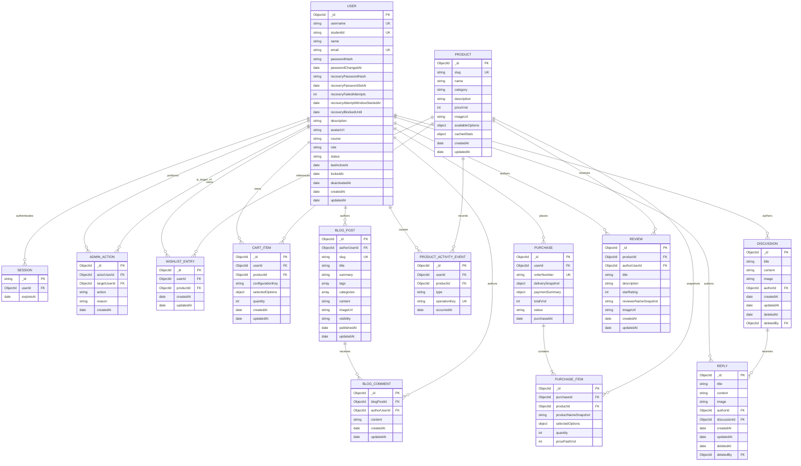

# MongoDB Atlas schema and implementation status

The final group application uses MongoDB Atlas for persistent backend data.
This document separates the collections implemented for Assessment 3 from
module data that still uses runtime stores and collections that remain planned.

## Scope and implementation status

| Area | Current implementation | MongoDB Atlas status or future direction |
| --- | --- | --- |
| Accounts, login, profile, and administration | Login reads MongoDB credentials and status. Profile email/password changes and lock/deactivation changes persist in `users`. Matching runtime users and other Profile edits remain in memory. | Partial migration through `studentId`, not a full Account migration. MongoDB `sessions` and `adminActions` remain planned. |
| Password recovery | A pre-set recovery password is hashed in `users`. Successful verification grants 10-minute Reset access in the server session. No email is sent. | Implemented with User fields and the current in-memory session. The earlier `passwordResetTokens` collection design is not used. |
| Catalogue, wishlist, cart hand-off, and purchase history | Products and user-owned relations remain in memory. | `products`, `wishlistEntries`, `cartItems`, `purchases`, `purchaseItems`, and `productActivityEvents` remain planned. |
| Discussion Forum | Implemented with MongoDB `users`, `discussions`, and `replies`, ObjectId references, image paths, ownership checks, and soft deletion. | Implemented and tested. |
| Blog and comments | Posts and comments currently remain in memory. | `blogPosts` and `blogComments` remain planned. |
| Course reviews and ratings | Reviews currently remain in memory and are linked to the signed-in user and course code. | A `reviews` collection linked to Users and courses remains planned. |
| Sitemap | Static navigation and account links are defined in `views/sitemap.ejs`. Active MongoDB Discussions and Replies, plus the current Blog and Review data, are added when the page is rendered. | Implemented as a derived view. It does not require its own collection. |

The implemented Mongoose models and current collections are documented
separately from the future-facing collection designs below. Planned collections
must be confirmed with the relevant module owner before implementation.

## Full-team relationship diagram

The diagram combines implemented collections with the planned collections
listed above. Recovery adds fields to `USER`, not a separate token collection.
`SESSION` and `ADMIN_ACTION` represent planned MongoDB collections.



`FK` labels represent application-level references. MongoDB does not enforce
relational foreign keys, so the service layer must validate every referenced
record, ownership rule, and account status.

## Collection contracts

### Shared account and administration collections

#### `users`

- The current schema defines unique `username`, `studentId`, and `email` fields.
  Seeded usernames and emails use normalized lowercase values.
- `name` is stored separately for display, and `course` is shown on Forum pages.
- `role` is `admin` or `member`.
- `status` is `active`, `locked`, or `deactivated`. The current status fields
  include `lockedAt` and `deactivatedAt`.
- `lastActiveAt` records the User's latest Forum create, edit, or delete action.
- The profile stores `name`, `description`, `email`, `avatarUrl`, and `course`.
  MongoDB stores the avatar path rather than the image file.
- The login password uses `passwordHash`. A pre-set recovery password uses a
  separate `recoveryPasswordHash`. Both are hashed with `bcryptjs`.
  APIs never return either hash or plain-text password. Profile responses expose
  only the boolean `recoveryConfigured` to show whether recovery is available.
- `createdAt` and `updatedAt` are stored in the User document. Current update
  routes set `updatedAt` explicitly.
- Login reads MongoDB credentials and status. Profile email, login password,
  recovery password, and account status changes persist in this collection.
  Account routes still require a matching runtime User through `studentId`.
  Other Profile edits, including name, description, and avatar, remain in memory.
  Storing these fields in the schema does not mean all Profile edits are migrated.

The following fields support password changes and recovery in `models/user.js`:

| Field | Mongoose type and initial default | Purpose |
| --- | --- | --- |
| `passwordChangedAt` | `Date`, `null` | Records a login password change so older sessions and Reset access can be rejected. |
| `recoveryPasswordHash` | `String`, `null` | Stores the bcrypt hash of the pre-set recovery password. |
| `recoveryPasswordSetAt` | `Date`, `null` | Records when recovery was configured. Reset access must match this value. |
| `recoveryFailedAttempts` | `Number`, `0`, minimum `0` | Counts failed recovery checks in the current attempt window. |
| `recoveryAttemptWindowStartedAt` | `Date`, `null` | Marks the start of the 15-minute attempt window. |
| `recoveryBlockedUntil` | `Date`, `null` | Blocks recovery checks until this time without locking normal Login. |

After a successful Reset, `recoveryPasswordHash` and `recoveryPasswordSetAt`
are removed with `$unset`. They can therefore be absent as well as `null`.
The counter returns to `0`, and its window and block timestamps return to `null`.

New login passwords use 8–64 printable ASCII characters without spaces.
Recovery passwords use 12–64. Both require uppercase and lowercase letters and
a number. Existing legacy passwords can still be used to Login; these new-input
rules do not retroactively reject them.

#### `sessions` (planned MongoDB collection)

- Current sessions use Express `MemoryStore`, not a MongoDB collection.
  `passwordResetAuthorisation` is session data that grants Reset access for
  10 minutes. The server checks its expiry and account-state snapshot.
- Restarting Node clears Login sessions and any unused Reset access. User
  passwords, recovery configuration, and failed-attempt blocks remain in MongoDB.
- Protected requests check the current account status and relevant timestamps.
  Locking, deactivation, or a login password change rejects older access.
- A future MongoDB-compatible session store could persist sessions with
  `createdAt`, `lastSeenAt`, and `expiresAt`. Its TTL index is planned, not part
  of the current implementation.

#### Password recovery workflow (implemented)

1. A logged-in user sets or replaces a recovery password through
   `PATCH /api/profile` after confirming the current login password. The
   recovery password must differ from the login password.
2. `POST /forgot-password` checks the current MongoDB email and the pre-set
   recovery password for an active account. No email or email reset link is sent.
3. Successful verification stores the target User and account-state snapshot in
   the server session for 10 minutes. The browser cannot choose a target User ID.
4. `POST /reset-password` requires that session and a new login password that
   differs from both the current login password and the recovery password.
   One conditional User update changes `passwordHash`, sets `passwordChangedAt`,
   removes the recovery hash and setup time, and clears failed-attempt state.
   A second request cannot consume the same recovery password again.
5. A login password, email, recovery password, lock, or deactivation change
   invalidates Reset access issued against the earlier account state.

Five failed recovery checks for an eligible account within a 15-minute window
start a 15-minute recovery-only block in MongoDB. This does not change
`users.status` or lock normal Login. Successful recovery verification clears
the failed-attempt state. A Node restart does not clear a stored block.

Users who never configured recovery, or who forgot their recovery password,
cannot use this flow. There is no identity-check bypass.

The earlier `passwordResetTokens` design used `tokenHash`, `expiresAt`, and
`usedAt` for an email-link approach. It is not used by the current recovery
routes and does not require a collection or indexes for this implementation.

#### `adminActions` (planned MongoDB collection)

- Records security-sensitive actions such as `lock_user`, `unlock_user`, and
  `deactivate_user`, including actor, target, reason, and timestamp.
- Administration uses the same `users.status` source of truth; the audit record
  is evidence, not a second copy of account state.

### Product, wishlist, cart, and order collections

#### `products`

- `slug` is the stable URL/API identifier corresponding to the current string
  product ID.
- Store prices as integer VND to avoid floating-point rounding.
- Fixed product data includes title/name, description, category, image URL and
  alt text, price, and valid selectable details such as size or colour.
- `cachedStats` may expose wishlist, cart, and purchase counts efficiently, but
  it is a rebuildable projection of entries/events. It is not an independent
  source of truth.

#### `wishlistEntries`

- A row represents a currently saved user-product relationship and stores
  references rather than copied product details.
- A compound unique index on `{ userId, productId }` prevents duplicate wishlist
  entries for the same user and product.
- Removing or moving an item deletes this current-state relation, while the
  corresponding immutable activity event preserves historical statistics.

#### `cartItems`

- A row represents a product currently in one user's cart.
- `selectedOptions` holds user-editable text details validated against the
  product's allowed options; `quantity` is a positive bounded integer.
- Product title, image, and current price remain fixed product data and are
  populated from `products` when the cart is retrieved.
- `configurationKey` is a deterministic key made from normalized selected
  options. A compound unique index prevents duplicate rows for the same user,
  product, and configuration; adding that configured product increments its
  quantity.

#### `purchases` and `purchaseItems`

- `purchases` is the completed order header with user, order number, totals,
  delivery snapshot, safe payment summary, status, and purchase time.
- Never store a CVV or full credit-card number. A simulated checkout should
  validate and discard raw input, retaining only safe fields such as card brand,
  last four digits, and a mock/provider reference.
- `purchaseItems` captures product name, image URL, selected details, quantity,
  and `pricePaidVnd` at checkout. Later catalogue edits therefore do not rewrite
  order history.
- A detailed confirmation page reads the immutable purchase and item snapshots.

#### `productActivityEvents`

- Immutable event types are `wishlist_added`, `wishlist_removed`,
  `moved_to_cart`, and `purchased`.
- These events make the assignment's historical statistics possible. Current
  wishlist rows can answer "how many users have this saved now", but cannot
  answer "how many times was this ever added or moved" after rows are deleted.
- `operationKey` is an idempotency key. A retry must not increment a statistic
  twice.
- Public statistics are aggregated by product and type; user identifiers are
  never exposed in the public result.

### Discussion Forum collections

#### `discussions`

- Each Discussion stores `title`, `content`, a required `image` path,
  `authorId`, and timestamps.
- `authorId` references the shared `users` collection.
- Uploaded JPEG and PNG files are stored in `public/uploads`. The document
  stores only the public image path.
- Editing updates `updatedAt`. Soft deletion sets `deletedAt` and `deletedBy`
  without removing the document from MongoDB.
- Public Forum and Sitemap queries exclude Discussions where `deletedAt` is set.

#### `replies`

- Each Reply stores `title`, `content`, a required `image` path, `authorId`,
  `discussionId`, and timestamps.
- `authorId` references the shared `users` collection, and `discussionId`
  references the parent Discussion.
- Editing updates `updatedAt`. Soft deletion sets `deletedAt` and `deletedBy`
  without removing the document from MongoDB.
- Replies are not nested. The current schema does not have `parentPostId` or
  Reply-to-Reply relationships.
- Edit and delete routes verify that the authenticated User matches `authorId`.
- The Title filter checks the original Discussion title. The Content filter
  checks Discussion content and active Reply content.
- Newest sorting compares the original Discussion time with its active Reply
  times. Oldest sorting uses the original Discussion time.

### Blog collections

#### `blogPosts`

- Main data includes title, author, added/published date, tags/categories, full
  text, image URL/alt text, and a generated preview summary/thumbnail.
- `visibility` is `draft`, `public`, or `archived`. Public list views return
  previews; detail views return full content and comments.
- Only the author (or an explicitly authorized administrator) may edit or delete
  a post. `deletedAt` can retain moderation/audit history while excluding the
  post from public queries.
- Search covers title, summary, full text, tags, and categories; separate indexes
  support author and date filters.

#### `blogComments`

- A comment references its blog post and authenticated author and stores content
  plus creation/update timestamps.
- Although comment creation is not separately listed as a CRUD requirement, a
  stored comment collection is required for the mandated detailed view that
  displays comments.
- If comment deletion is supported, use the same ownership and soft-deletion
  pattern as forum posts.

### Product review and rating collection

#### `reviews`

- Each review references the product and authenticated author and stores title,
  description, integer `starRating` from 1 to 5, reviewer-name snapshot, added
  date, image URL, and image alt text.
- The reviewer snapshot preserves what was displayed at submission time; the
  user reference remains the authority for ownership.
- Before creation, the service checks purchase history or another documented
  product-use entitlement. The client cannot declare itself eligible.
- List responses provide previews; detail responses provide the full review.
  Search/filter supports title, description, reviewer, rating, product, and date.
- Only the authenticated author (or an authorized moderator) may update or
  delete a review. Soft deletion is recommended if moderation history is needed.
- Whether one active review is allowed per user-product pair is a team product
  decision, not an assignment requirement. Add a partial unique index only if
  the team adopts that rule.

## Implemented and planned indexes

The unique `username`, `studentId`, and `email` indexes are created from the
current Mongoose User schema. The current `discussions` and `replies`
collections use MongoDB's default `_id` indexes. Other index commands in this
section are planned designs until the relevant module owner implements and
verifies them in MongoDB Atlas.

Recovery uses the existing User identity indexes and the default `_id` index.
It does not add a token index or TTL index. The server checks the recovery
timestamps stored on the User and the expiry of the in-memory Reset access.

Each collection may have only one MongoDB text index, so related searchable
fields must be combined when a text index is added.

```javascript
db.users.createIndex({ username: 1 }, { unique: true });
db.users.createIndex({ studentId: 1 }, { unique: true });
db.users.createIndex({ email: 1 }, { unique: true });
db.users.createIndex({ role: 1, status: 1, name: 1 });

db.sessions.createIndex({ expiresAt: 1 }, { expireAfterSeconds: 0 });
db.sessions.createIndex({ userId: 1 });
db.adminActions.createIndex({ actorUserId: 1, createdAt: -1 });
db.adminActions.createIndex({ targetUserId: 1, createdAt: -1 });

db.products.createIndex({ slug: 1 }, { unique: true });
db.products.createIndex({ category: 1, name: 1 });
db.products.createIndex({ name: 1 });
db.products.createIndex({ priceVnd: 1 });
db.products.createIndex({ name: "text", description: "text", category: "text" });
db.wishlistEntries.createIndex({ userId: 1, productId: 1 }, { unique: true });
db.wishlistEntries.createIndex({ productId: 1, createdAt: -1 });
db.cartItems.createIndex(
    { userId: 1, productId: 1, configurationKey: 1 },
    { unique: true }
);
db.cartItems.createIndex({ userId: 1, quantity: 1 });
db.cartItems.createIndex({ userId: 1, updatedAt: -1 });
db.purchases.createIndex({ orderNumber: 1 }, { unique: true });
db.purchases.createIndex({ userId: 1, purchasedAt: -1 });
db.purchaseItems.createIndex({ purchaseId: 1 });
db.purchaseItems.createIndex({ productId: 1 });
db.productActivityEvents.createIndex({ operationKey: 1 }, { unique: true });
db.productActivityEvents.createIndex({ productId: 1, type: 1, occurredAt: -1 });
db.productActivityEvents.createIndex({ userId: 1, productId: 1, occurredAt: -1 });

// Planned Forum indexes. These are not implemented yet.
db.discussions.createIndex({ deletedAt: 1, createdAt: -1 });
db.discussions.createIndex({ authorId: 1, updatedAt: -1 });
db.discussions.createIndex({ title: "text", content: "text" });
db.replies.createIndex({ discussionId: 1, deletedAt: 1, createdAt: 1 });
db.replies.createIndex({ authorId: 1, updatedAt: -1 });
db.replies.createIndex({ title: "text", content: "text" });

db.blogPosts.createIndex({ slug: 1 }, { unique: true });
db.blogPosts.createIndex({ authorUserId: 1, publishedAt: -1 });
db.blogPosts.createIndex({ visibility: 1, publishedAt: -1 });
db.blogPosts.createIndex({ visibility: 1, categories: 1, publishedAt: -1 });
db.blogPosts.createIndex({ visibility: 1, tags: 1, publishedAt: -1 });
db.blogPosts.createIndex({
    title: "text",
    summary: "text",
    content: "text",
    tags: "text",
    categories: "text"
});
db.blogComments.createIndex({ blogPostId: 1, createdAt: 1 });
db.blogComments.createIndex({ authorUserId: 1, createdAt: -1 });

db.reviews.createIndex({ productId: 1, createdAt: -1 });
db.reviews.createIndex({ productId: 1, starRating: 1 });
db.reviews.createIndex({ authorUserId: 1, createdAt: -1 });
db.reviews.createIndex({ starRating: 1, createdAt: -1 });
db.reviews.createIndex({
    title: "text",
    description: "text",
    reviewerNameSnapshot: "text",
    imageAlt: "text"
});
```

Every write endpoint must catch duplicate-key error `11000` and translate it to
a controlled `409 Conflict`. An index is not a substitute for a useful API
response or server-side validation.

## Representative document shapes

The values are illustrative. Real password hashes, reset tokens, session IDs,
and payment secrets must not appear in source control.

```javascript
// users - implemented collection; Account persistence is partly migrated
{
    _id: ObjectId("66aa00000000000000000001"),
    username: "dat.pham",
    studentId: "S4221230",
    name: "Dat Pham",
    email: "s4221230@rmit.edu.vn",
    passwordHash: "<bcrypt-password-hash>",
    passwordChangedAt: null,
    recoveryPasswordHash: null,
    recoveryPasswordSetAt: null,
    recoveryFailedAttempts: 0,
    recoveryAttemptWindowStartedAt: null,
    recoveryBlockedUntil: null,
    description: "RMIT Connect administrator and student community organiser.",
    avatarUrl: "/images/user_icon.png",
    course: "Bachelor of Business",
    role: "admin",
    status: "active",
    lastActiveAt: ISODate("2026-08-19T04:05:00Z"),
    lockedAt: null,
    deactivatedAt: null,
    createdAt: ISODate("2026-08-02T02:00:00Z"),
    updatedAt: ISODate("2026-08-02T02:00:00Z")
}

// products - fixed catalogue data plus a rebuildable statistics projection
{
    _id: ObjectId("66bb00000000000000000001"),
    slug: "data-bootcamp",
    name: "Data Visualisation Bootcamp",
    category: "Short Course",
    description: "A practical evening data visualisation session.",
    priceVnd: 95000,
    imageUrl: "/images/data-bootcamp.jpg",
    imageAlt: "Two students pointing at information on a laptop screen",
    availableOptions: { session: ["Tuesday", "Thursday"] },
    cachedStats: { savedNow: 63, addedTotal: 84, movedToCartTotal: 28, purchasedTotal: 17 },
    createdAt: ISODate("2026-07-01T08:00:00Z"),
    updatedAt: ISODate("2026-08-15T08:30:00Z")
}

// wishlistEntries - one current saved relation per user and product
{
    _id: ObjectId("66cc00000000000000000001"),
    userId: ObjectId("66aa00000000000000000001"),
    productId: ObjectId("66bb00000000000000000001"),
    createdAt: ISODate("2026-08-15T08:30:00Z"),
    updatedAt: ISODate("2026-08-15T08:30:00Z")
}

// cartItems - editable quantity/options, fixed product data populated on read
{
    _id: ObjectId("66dd00000000000000000001"),
    userId: ObjectId("66aa00000000000000000001"),
    productId: ObjectId("66bb00000000000000000001"),
    configurationKey: "session=thursday",
    selectedOptions: { session: "Thursday" },
    quantity: 1,
    createdAt: ISODate("2026-08-15T08:35:00Z"),
    updatedAt: ISODate("2026-08-15T08:35:00Z")
}

// purchases - safe order, delivery, and payment summary
{
    _id: ObjectId("66ee00000000000000000001"),
    userId: ObjectId("66aa00000000000000000001"),
    orderNumber: "RMIT-20260815-0001",
    deliverySnapshot: {
        recipientName: "Dat Pham",
        addressLine1: "702 Nguyen Van Linh",
        city: "Ho Chi Minh City",
        postalCode: "700000",
        country: "Vietnam"
    },
    paymentSummary: {
        method: "simulated_card",
        cardBrand: "visa",
        cardLast4: "4242",
        providerReference: "mock_01"
    },
    totalVnd: 95000,
    status: "confirmed",
    purchasedAt: ISODate("2026-08-15T08:40:00Z")
}

// purchaseItems - immutable checkout snapshot
{
    _id: ObjectId("66ff00000000000000000001"),
    purchaseId: ObjectId("66ee00000000000000000001"),
    productId: ObjectId("66bb00000000000000000001"),
    productNameSnapshot: "Data Visualisation Bootcamp",
    imageUrlSnapshot: "/images/data-bootcamp.jpg",
    selectedOptions: { session: "Thursday" },
    quantity: 1,
    pricePaidVnd: 95000
}

// discussions - implemented MongoDB collection
{
    _id: ObjectId("670000000000000000000001"),
    title: "Where is a quiet place to study on campus?",
    content: "Is there a quiet study area with charging points?",
    image: "/images/RMIT_campus.png",
    authorId: ObjectId("66aa00000000000000000001"),
    createdAt: ISODate("2026-08-18T09:15:00Z"),
    updatedAt: ISODate("2026-08-18T09:15:00Z"),
    deletedAt: null,
    deletedBy: null
}

// replies - implemented MongoDB collection
{
    _id: ObjectId("670000000000000000000002"),
    title: "Library study area",
    content: "The library has quiet study areas and charging points.",
    image: "/images/RMIT_campus.png",
    authorId: ObjectId("66aa00000000000000000001"),
    discussionId: ObjectId("670000000000000000000001"),
    createdAt: ISODate("2026-08-18T09:28:00Z"),
    updatedAt: ISODate("2026-08-18T09:28:00Z"),
    deletedAt: null,
    deletedBy: null
}

// blogPosts and blogComments - preview fields support list view
{
    _id: ObjectId("671000000000000000000001"),
    authorUserId: ObjectId("66aa00000000000000000001"),
    slug: "campus-photography-walk-notes",
    title: "Campus photography walk notes",
    summary: "Five practical lessons from the student photo walk.",
    tags: ["photography", "campus"],
    categories: ["Club Activity"],
    content: "<sanitized rich text or plain text>",
    imageUrl: "/uploads/blog/photo-walk-notes.jpg",
    imageAlt: "Students photographing the campus courtyard",
    visibility: "public",
    publishedAt: ISODate("2026-08-16T10:00:00Z"),
    updatedAt: ISODate("2026-08-16T10:00:00Z")
}
{
    _id: ObjectId("671000000000000000000002"),
    blogPostId: ObjectId("671000000000000000000001"),
    authorUserId: ObjectId("66aa00000000000000000001"),
    content: "The lighting tip was especially useful.",
    createdAt: ISODate("2026-08-16T10:30:00Z"),
    updatedAt: ISODate("2026-08-16T10:30:00Z")
}

// reviews - ownership comes from authorUserId, display name is a snapshot
{
    _id: ObjectId("672000000000000000000001"),
    productId: ObjectId("66bb00000000000000000001"),
    authorUserId: ObjectId("66aa00000000000000000001"),
    title: "Useful practical introduction",
    description: "Clear examples and enough time to practise each chart.",
    starRating: 5,
    reviewerNameSnapshot: "Dat Pham",
    imageUrl: "/uploads/reviews/data-bootcamp-board.jpg",
    imageAlt: "Completed chart exercise on the workshop whiteboard",
    createdAt: ISODate("2026-08-17T07:00:00Z"),
    updatedAt: ISODate("2026-08-17T07:00:00Z")
}

// productActivityEvents - immutable input for historical wishlist statistics
{
    _id: ObjectId("673000000000000000000001"),
    userId: ObjectId("66aa00000000000000000001"),
    productId: ObjectId("66bb00000000000000000001"),
    type: "wishlist_added",
    operationKey: "wishlist-add:user-dat:data-bootcamp:20260815T083000Z",
    occurredAt: ISODate("2026-08-15T08:30:00Z")
}
```

## Atomic transitions and invariants

1. Resolve identity from the authenticated session; never accept a client-sent
   owner ID as authority.
2. Reject every protected operation when the user is locked or deactivated.
3. Validate references, input allowlists, lengths, ratings, prices, and quantities
   on the server before beginning the write.
4. For wishlist-to-cart, atomically delete the wishlist entry, upsert the cart
   item, add a `moved_to_cart` event, and update/rebuild cached statistics.
5. For checkout, atomically create the purchase and item snapshots, remove or
   update cart rows, add `purchased` events, and return the completed order.
6. Creating a Discussion inserts one document into `discussions`. Creating a
   Reply inserts one document into `replies` with its `discussionId`. Soft
   deletion updates `deletedAt` and `deletedBy`. The related User activity update
   is currently a separate operation, not a MongoDB transaction.
7. Current Forum routes derive the User from the authenticated session.
   Discussion write predicates include `_id`, `authorId`, and `deletedAt: null`.
   Reply changes first require an active parent Discussion, and their write
   predicates also include `discussionId`. A write that matches no active owned
   document returns `404` before the related User activity is updated. Blog and
   Review authorization must follow each module owner's confirmed implementation.
8. Use `operationKey` or an equivalent idempotency token for retried transitions,
   then commit. Abort the transaction if any operation fails.
9. Re-read and return the authenticated user's current state after commit rather
   than constructing a response from uncommitted client input.
10. Password Reset uses one conditional `users` update to change the login
    password and consume the recovery password together. It must match the
    verified account state. This is a single-document update, not a
    multi-document transaction.

Current account locking updates `users.status` and its timestamp. Existing
sessions are denied using the current account state. The additional
`adminActions` audit insert remains planned.

## Sitemap persistence decision

The Sitemap does not need its own MongoDB collection because it combines
static links with current content when the page is rendered.

- Static navigation and account links are defined in `views/sitemap.ejs`.
- `showSitemap()` queries MongoDB for Discussions where `deletedAt` is `null`.
- It also queries Replies where `deletedAt` is `null` and the parent Discussion
  is active.
- The current active Blog data and Review data are passed from their existing
  runtime stores.
- Each active Discussion is displayed with its title and link. Its active
  Replies are displayed underneath with links to their positions on the detail
  page.
- The Sitemap EJS view builds the clickable HTML response for each request.

Persisting a separate Sitemap document would duplicate existing route and
content data and could become outdated.

## Assessment 2 to Assessment 3 persistence mapping

| Assessment 2 or runtime structure | Assessment 3 destination or status | Migration note |
| --- | --- | --- |
| Account users in `modules/account/src/data.js` | Shared `users`, partly migrated | Login reads MongoDB credentials and status. Email/password and lock/deactivation changes persist. A matching runtime User through `studentId` is still required; other Profile edits remain in memory. |
| Password recovery | Fields in `users` plus current in-memory session | Recovery hash, setup time, and failed-attempt state persist. Reset access lasts 10 minutes in the session. No `passwordResetTokens` collection is used. |
| Discussion and Reply arrays in `forum-data.js` | `discussions` and `replies` | Migration completed with ObjectId references, image paths, timestamps, and soft deletion. `forum-data.js` remains only for the temporary Account user adapter. |
| Product template/`products` array | Planned `products` | Convert string IDs to slugs/ObjectIds and treat seeded statistics as a cache only. |
| `wishlist` array | Planned `wishlistEntries` | Preserve unique User-Product ownership and timestamps. |
| `cart` array | Planned `cartItems` | Add bounded quantity, validated selected options, and a configuration key. |
| `purchases` array | Planned `purchases` and `purchaseItems` | Expand the current one-product history into immutable order snapshots. |
| Express `MemoryStore` | Still in use; MongoDB `sessions` planned | A Node restart clears Login sessions and Reset access. A durable compatible session store with TTL expiry requires separate implementation. |
| No current event history | Planned `productActivityEvents` | Required for accurate all-time add, cart, and purchase statistics. |
| Blog runtime data | Planned `blogPosts` and `blogComments` | Confirm the final fields and migration with the Blog module owner. |
| Review runtime data | Planned `reviews` | Confirm the final fields and migration with the Review module owner. |
| Dynamic Sitemap inputs | No collection required | Read active Discussions and their active Replies from MongoDB, then combine them with static EJS links and the current Blog and Review data. |

The existing Forum page and form routes were retained while Discussion and
Reply persistence moved from arrays to Mongoose models. Other modules can use
the same staged approach after their owners confirm the final fields and
relationships.

## Remaining assumptions requiring team confirmation

- The partial Account migration and recovery-password design in this review
  branch require the shared Account owner's review before merging into the
  team branch. They do not complete migration of the remaining Account data.
- The final storage method for Product, Blog, and Review images requires
  confirmation from the relevant module owners. The Forum currently stores
  uploaded files in `public/uploads` and saves their public paths in MongoDB.
- Blog comments are planned for persistence because the detail view displays
  them, but the Blog module owner must confirm the final fields and CRUD scope.
- Reviews may use purchase history or another documented entitlement to verify
  product use. The Review module owner must confirm the final rule.
- One active Review per User-Product pair is optional. The team must decide and
  document that policy before adding a unique index.
